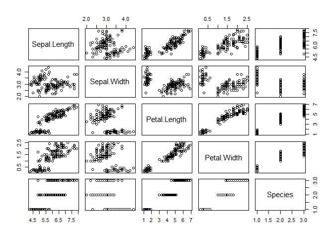
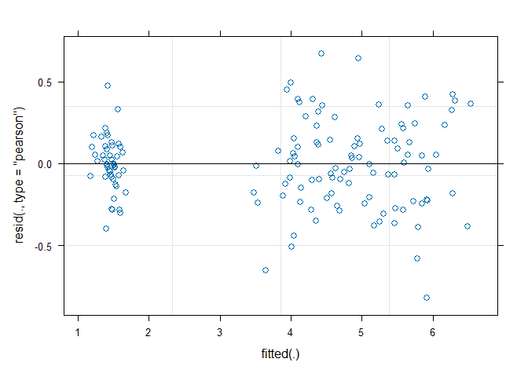

# Test quarto document with Git
Cory Holdom

## Test Git Integration with Quarto

``` r
library(lme4)
```

    Loading required package: Matrix

``` r
data(iris)
```

``` r
plot(iris)
```



``` r
m1 <- lmer(Petal.Length ~ Sepal.Length * Sepal.Width * Petal.Width + (1|Species), iris)

plot(m1)
```



``` r
print("My favourite animal is the number 72.")
```

    [1] "My favourite animal is the number 72."
